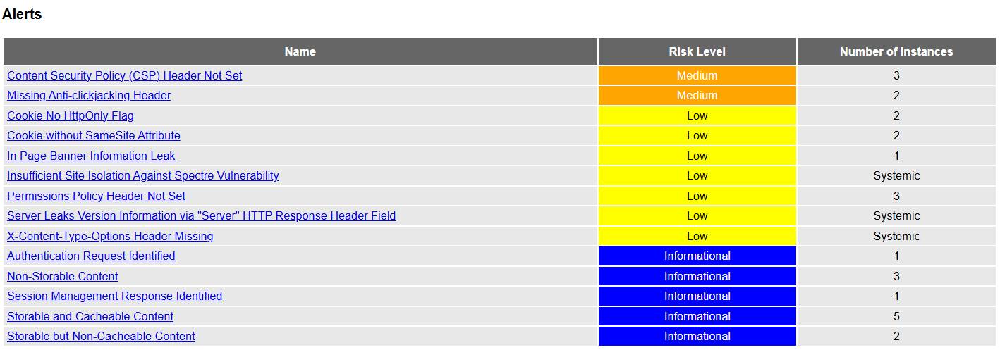

# Nikto e OWASP ZAP - Análise de vulnerabilidades

Todos os testes foram realizados em um ambiente local e deliberadamente vulnerável (DVWA).

## Passo a passo de configuração:

1. Iniciar o DVWA via docker compose
2. Configurar o DVWA:
    - Login: admin / password
    - Security: Low
    - Create / Reset Database

3. Executar os comandos abaixo:

# 1. OWASP ZAP

Performa um scan para detectar headers de segurança ausentes, vazamentos de informação e de cookies.
O comando foi executado para ter como alvo o DVWA local e gerar os relatórios em formato HTML, JSON e Markdown.

```
docker run --rm -t \
  -v "$OUTDIR:/zap/wrk" \
  ghcr.io/zaproxy/zaproxy:stable \
  zap-baseline.py \
    -t "$TARGET_URL" \
    -r zap_report.html \
    -J zap_report.json \
    -w zap_report.md \
    -m 2
```
Comando definido em [zap_baseline.sh](./scripts/zap_baseline.sh)

# 2. Nikto

Faz um scan por arquivos maliciosos, versões desatualizadas do servidor e problemas de configuração.

O comando foi executado para ter como alvo o DVWA local e gerar o relatório em formato TXT.
```
docker run --rm -t \
  -v "$OUTDIR:/out" \
  alpine/nikto:2.1.6 \
  -h "$TARGET_URL" \
  -Format txt \
  -output /out/nikto.txt
```
Comando definido em [nikto.sh](./scripts/nikto.sh)

# Resultados:

## OWASP ZAP

Analisando o zap_report.html, foram identificados 2 alertas de risco médio e 7 alertas de risco baixo.


Os alertas de risco médio estão relacionados a:
- Content Security Policy (CSP) Header Not Set

Esse alerta indica que o servidor está permitindo que o navegador carregue recursos de qualquer origem, o que pode facilitar ataques de Cross-Site Scripting (XSS).

- Missing Anti-clickjacking Header

Esse alerta indica que o servidor não está protegendo contra ataques de clickjacking, onde um invasor pode enganar o usuário a clicar em um elemento invisível (iframe, por exemplo) de uma página web legítima.

Os alertas de risco baixo envolvem diversas questões, como risco nos cookies e na sessão, headers de segurança ausentes, vazamento de informações do servidor, entre outros.



## Nikto

Analisando o nikto.txt, foi identificado algumas falhas de segurança. Assim como o ZAP, o Nikto identificou falhas relacionadas aos cookies:

```
- Cookie PHPSESSID created without the httponly flag
- Cookie security created without the httponly flag
```

Além dos headers de segurança ausentes:

```
- X-Frame-Options header is not present
- X-XSS-Protection header is not defined
- X-Content-Type-Options header is not set
```

Também encontrou vazamento de informações do servidor:

```
- Server leaks inodes via ETags
- Apache default file found (/icons/README)
```

Encontrou indexação de diretórios sensíveis:

```
- /config/: Directory indexing found
- /docs/: Directory indexing found
```

E também identificou uma página de login, que pode servir como porta de entrada para ataques:

```
- /login.php: Admin login page/section found
